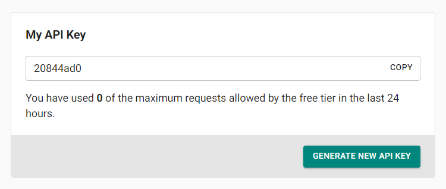

# CSV File Data Generator
This repository contains a TypeScript Node.js project that utilizes the Axios library to interact with the Mockaroo API and generate CSV files. The project aims to streamline the process of generating mock data in CSV format for testing and development purposes.

## Table of Contents
- [Prerequisites](#prerequisites)
- [Installation](#installation)
- [Configuration](#configuration)
- [Importing the API Collection](#importing-the-api-collection)
- [Usage](#usage)
    - [Endpoints](#endpoints)
        - [Field Decsriptions](#field-descriptions)
    - [Examples](#examples)
- [Note](#note)

## Prerequisites
Before you begin, ensure you have the following prerequisites:

- Node.js (at least version 14)
- npm (Node Package Manager)
- [Postman](https://www.postman.com/downloads/) installed on your machine.
- Basic understanding of API concepts.

## Installation
1. Clone this repository to your local machine using:
```bash
git clone <repository-url>
```
2. Navigate to the project directory:
```bash 
cd project-directory
```
3. Install the project dependencies:
```bash
npm install
```

## Configuration
To use the Mockaroo API, you'll need an API key. Follow these steps to configure the project:

1. Sign up or log in to [Mockaroo](https://mockaroo.com/sign-in).
2. Once logged in, navigate to [My Account](https://mockaroo.com/myaccount) and locate your API key.

    

3. Create a `.env` file in the project root directory.
4. Add your Mockaroo API key to the `.env` file:
```
MOCKAROO_API_KEY=your-api-key-goes-here
```

## Importing the API Collection
1. Open Postman.
2. Click on the Import button in the top-left corner.
3. Select the postman-collection.json file from the project directory and click Open.
4. The API collection will now be imported into your Postman workspace.

## Usage
The project provides APIs to generate CSV files using the Mockaroo API up to 200,000 records. Follow these steps to generate a CSV file:

### Endpoints
The API collection contains two endpoints covering different functionalities. 

1. `http://localhost:3000/api/generate-csv-file?apiKey=[Mockaroo API Key]`

    Kindly visit [Mockaroo](https://mockaroo.com/) to explore the various available data types. Afterward, precisely copy and paste the type names into the API payload for the fieldName that you intend to generate in your CSV file.

    ```json
    {
        "fileName": "CommentsData",
        "fields": {
            "post_id": {
                "type": "Row Number"
            },
            "user_id": {
                "type": "Row Number"
            },
            "comment": {
                "type": "Words",
                "min": 3,
                "max": 5
            }
        },
        "numRows": 40000
    }
    ```

    ### Field Descriptions
    - `fileName (string)`: Specifies the name of the generated file, in this case, "CommentsData".
    - `fields (object)`: Defines the fields present in each record of the dataset. Each field is described by its name and specifications.
    - `numRows (integer)`: Specifies the number of rows (records) to generate in the dataset, which is 40000 in this case.

    `Note:` If your CSV file does not contain headers at the top, please locate them within the file and relocate them to the beginning.

2. `http://localhost:3000/api/download-csv-file?fileName=[Name of your file]`

    `Note:` This API will not function in Postman; instead, open it in any web browser to initiate the file download.

### Examples
We provide example requests and responses for each endpoint within Postman. You can use these examples as a starting point for making your own requests.

## Note
The payload provided in this documentation is just a sample. You can adapt the payload structure, field specifications, and other parameters according to your specific requirements.

Make sure to validate the generated data against your use case's requirements to ensure accuracy and integrity.